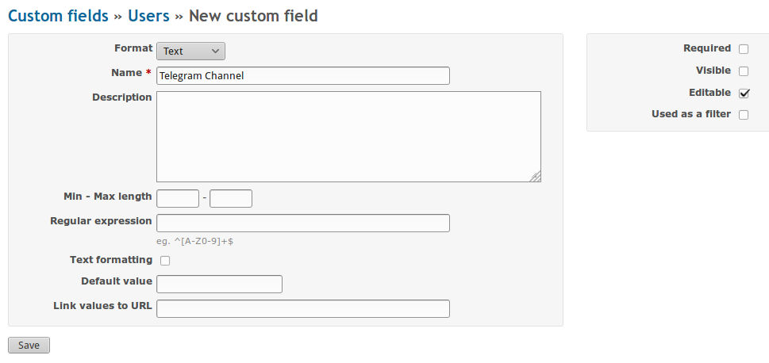
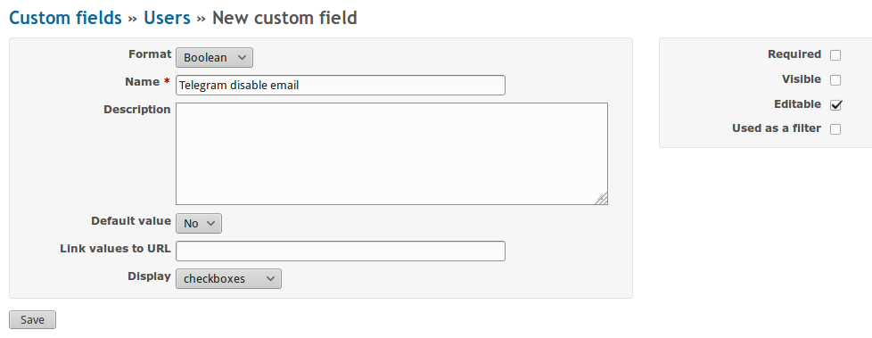

# Telegram messages plugin for Redmine

Credits go to massdest for this plugin, see https://github.com/massdest/redmine_telegram_email
Only difference in this fork is that messages are sent without sound.
This is done by adding 1 line to the lib:
params[:disable_notification] = 1

This plugin send messages as email, only to the Telegram. So you can disable email and use Telegram only, or use both.  

## Installation

From your Redmine plugins directory, clone this repository as `redmine_telegram_email` (note
the underscore!):

    git clone https://github.com/Egregius/redmine_telegram_email redmine_telegram_email

You will also need the `httpclient` dependency, which can be installed by running

    bundle install

from the plugin directory.

Start migration command

	bundle exec rake redmine:plugins:migrate RAILS_ENV=production

Restart Redmine, and you should see the plugin show up in the Plugins page.

## Using

### Set bot token into settings

First of all go into `http://example.com/settings/plugin/redmine_telegram_email` and set some settings, important is **Telegram BOT Token**

### Creating custom fields

Create two user custom fields: `http://example.com/custom_fields/new?utf8=✓&type=UserCustomField` named **Telegram Channel** (text) and **Telegram disable email** (boolean, default no, checkboxes).

The channel can be entered per user settings http://example.com/my/account for every user who wants to get notifications, in **Telegram Channel** field, for ex: 11111111 (not phone number, but chat id). 

To disable email and use only Telegram - check **Telegram disable email** 

And you can control Telegram messages by **Email notifications** dropdown.

To get Telegram Channel id you must create bot with [BotFather](https://core.telegram.org/bots#6-botfather), then get bot token and run [bot.py](/bot.py) from this folder, send any symbols to bot and it return your Telegram Channel id.

## Update plugin

Go to plugin girectory and pull last version
	
	git pull origin master

Then start migration database to new version

	bundle exec rake redmine:plugins:migrate RAILS_ENV=production

Last step - restart Redmine.

Now you can use last version.

## Uninstall

From Redmine plugin directory run command

	bundle exec rake redmine:plugins:migrate NAME=redmine_telegram_email VERSION=0 RAILS_ENV=production

After that restart Redmine.

For more information, see http://www.redmine.org/projects/redmine/wiki/Plugins.
